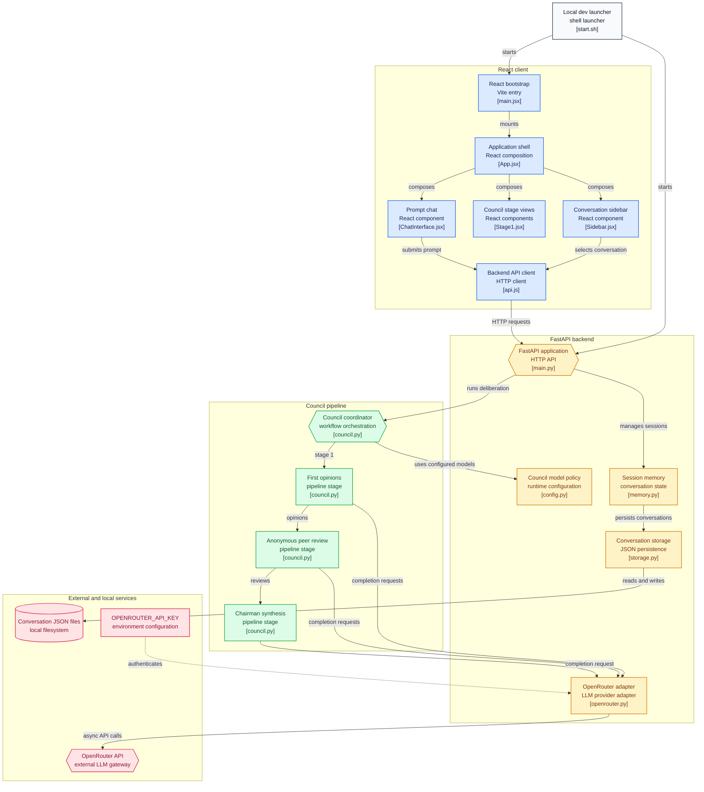

# LLM Council


Ask not one LLM, but a **council of LLMs**. LLM Council is a local ChatGPT-style web app that sends your query to multiple models via [OpenRouter](https://openrouter.ai/), has them anonymously review and rank each other's answers, and then has a Chairman model synthesize a single final response.

## How It Works

Every user message runs through a 3-stage deliberation pipeline:

1. **Stage 1 — First Opinions**
   The full conversation history is sent to every council model in parallel (`asyncio.gather`). Individual responses are shown in a tab view so you can inspect each model side by side.

2. **Stage 2 — Anonymous Peer Review**
   Responses are anonymized as `Response A, B, C…` so models can't play favorites. Each council model evaluates every response and returns a `FINAL RANKING:` list. The backend parses these rankings, de-anonymizes them via a `label_to_model` map, and computes **aggregate rankings** (average rank position, sorted best → worst). Raw evaluation text plus the extracted ranking are both shown in the UI for transparency.

3. **Stage 3 — Chairman Synthesis**
   The designated Chairman model receives the conversation history, all Stage 1 responses, all Stage 2 rankings, and the memory summary, then produces the final comprehensive answer.

```
User Query
  ↓
Stage 1: parallel queries → [individual responses]
  ↓
Stage 2: anonymize → parallel ranking queries → [evaluations + parsed rankings]
  ↓
Aggregate rankings (avg position)
  ↓
Stage 3: Chairman synthesis
  ↓
{ stage1, stage2, stage3, metadata }
```

## Features

- **Multi-model deliberation** — configurable council + chairman via `backend/config.py`
- **Anonymized peer review** — prevents bias during ranking; de-anonymized client-side for display only
- **Aggregate rankings** — average position across all peer evaluations
- **Conversation memory** — per-conversation short-term buffer (last 20 exchanges) + concise summary injected into Stage 2/3 prompts
  - `local` mode (default): fast on-device heuristic summarizer
  - `model` mode: LLM-based summarization via Chairman model
  - Switchable at runtime via `GET/POST /api/memory/mode`, clearable per conversation
- **Streaming (SSE)** — `POST /api/conversations/{id}/message/stream` streams `stage1_start → stage1_complete → stage2_start → … → complete` events
- **Persistent conversations** — JSON files in `data/conversations/`, auto-generated titles, full history passed as context on every turn
- **Transparent UI** — tabs for every raw model output, parsed rankings shown for validation, markdown rendering throughout
- **Graceful degradation** — failed models return `None` and are skipped; the council continues with successful responses

## Tech Stack

| Layer    | Technology |
|----------|------------|
| Backend  | FastAPI, Uvicorn, `httpx` (async), Pydantic, OpenRouter API |
| Frontend | React 19 + Vite, `react-markdown` |
| Storage  | JSON files in `data/conversations/` |
| Python mgmt | [uv](https://docs.astral.sh/uv/) (Python ≥ 3.10), npm for JS |

## Project Structure

```
llm-council/
├── backend/
│   ├── main.py        # FastAPI app, REST + SSE endpoints (port 8001)
│   ├── council.py     # Stage 1/2/3 orchestration, ranking parse + aggregation
│   ├── openrouter.py  # query_model / query_models_parallel client
│   ├── memory.py      # short-term buffer + local/model summarization
│   ├── storage.py     # JSON conversation persistence
│   └── config.py      # COUNCIL_MODELS, CHAIRMAN_MODEL, keys, memory settings
├── frontend/src/
│   ├── App.jsx            # orchestration, conversations + metadata state
│   ├── api.js             # backend API client
│   └── components/
│       ├── ChatInterface.jsx  # multiline input (Enter send / Shift+Enter newline)
│       ├── Stage1.jsx         # tab view of individual responses
│       ├── Stage2.jsx         # raw evaluations + extracted + aggregate rankings
│       └── Stage3.jsx         # final chairman answer
├── data/conversations/    # persisted chats (gitignored)
├── scripts/               # helper scripts
├── start.sh               # run backend + frontend together
└── pyproject.toml         # Python deps (uv)
```

## Prerequisites

- Python 3.10+ with [uv](https://docs.astral.sh/uv/) installed
- Node.js 18+ with npm
- An [OpenRouter API key](https://openrouter.ai/) with credits

## Setup

### 1. Install dependencies

Backend (from repo root):

```bash
uv sync
```

Frontend:

```bash
cd frontend
npm install
cd ..
```

### 2. Configure API key

Create a `.env` file in the project root:

```bash
OPENROUTER_API_KEY=sk-or-v1-...
```

Optional memory tuning (defaults shown):

```bash
MEMORY_MODE=local
MEMORY_LOCAL_MAX_SENTENCES=3
```

### 3. Configure models (optional)

Edit `backend/config.py`:

```python
COUNCIL_MODELS = [
    "mistralai/devstral-2512:free",
    "xiaomi/mimo-v2-flash:free",
    "kwaipilot/kat-coder-pro:free",
    "tngtech/deepseek-r1t2-chimera:free",
    "nvidia/nemotron-3-nano-30b-a3b:free",
    "deepseek/deepseek-r1-0528:free",
    "meta-llama/llama-3.3-70b-instruct:free",
]

CHAIRMAN_MODEL = "openai/gpt-oss-120b:free"
```

Any [OpenRouter model ID](https://openrouter.ai/models) works. The chairman may be a council member or a different model. Use `scripts/` helpers (e.g. connectivity tests) to verify a model ID before adding it.

## Running the Application

Option 1 — start script (backend + frontend):

```bash
./start.sh
```

Option 2 — run manually:

Terminal 1 (backend):

```bash
uv run python -m backend.main
```

Terminal 2 (frontend):

```bash
cd frontend
npm run dev
```

Then open **http://localhost:5173** (backend health: **http://localhost:8001/**).

> Ports: backend `8001`, frontend `5173` (Vite default). If you change them, update CORS origins in `backend/main.py` and the API base URL in `frontend/src/api.js`.

## Architecture


## Tech Stack

## API Reference

Base URL: `http://localhost:8001`

| Method | Endpoint | Description |
|--------|----------|-------------|
| `GET`  | `/` | Health check |
| `GET`  | `/api/conversations` | List conversations (metadata) |
| `POST` | `/api/conversations` | Create conversation |
| `GET`  | `/api/conversations/{id}` | Get full conversation |
| `POST` | `/api/conversations/{id}/message` | Run full 3-stage council (blocking) |
| `POST` | `/api/conversations/{id}/message/stream` | Run council with SSE progress events |
| `GET`  | `/api/conversations/{id}/memory` | Get memory (`short` + `summary`) |
| `POST` | `/api/conversations/{id}/memory/clear` | Clear conversation memory |
| `GET`  | `/api/memory/mode` | Get runtime memory mode |
| `POST` | `/api/memory/mode` | Set mode: `{"mode": "local" \| "model"}` |

`POST .../message` returns `{ stage1, stage2, stage3, metadata }`, where `metadata = { label_to_model, aggregate_rankings }`.

## Notes & Gotchas

- Run the backend as `python -m backend.main` **from the repo root** — backend modules use relative imports.
- Ranking parse fallback: if a model ignores the `FINAL RANKING:` format, the parser falls back to extracting `Response X` patterns in order.
- Memory metadata is ephemeral in API responses; conversation JSON persists `memory.short` / `memory.summary` per chat.
- If all council models fail, Stage 3 returns an error message instead of crashing.
